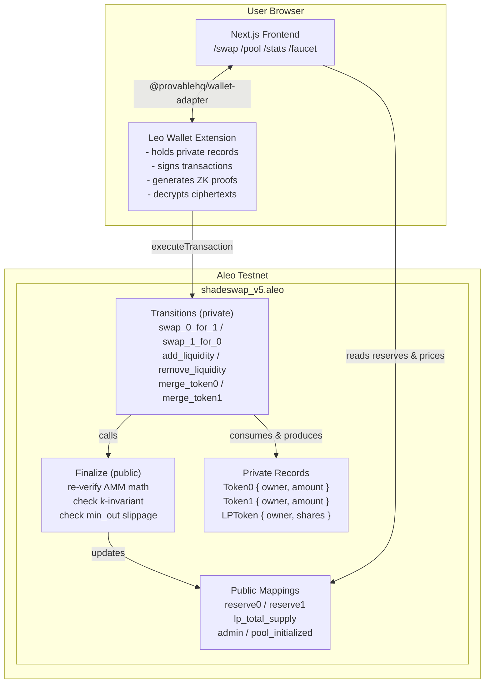
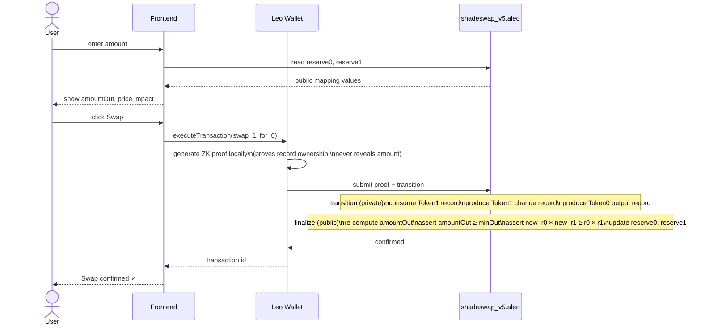
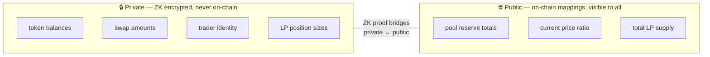
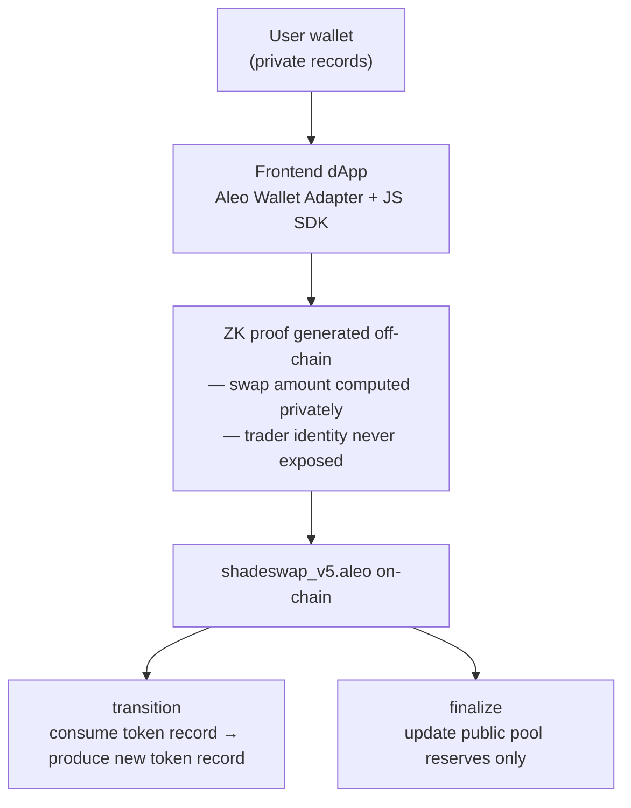

# ShadeSwap

> The private spot AMM DEX on Aleo — swap tokens without revealing who you are or how much you traded.

[](https://explorer.aleo.org)
[](https://docs.leo-lang.org)
[](LICENSE)

**Live Demo:** [https://shadeswap-ten.vercel.app/]
**Deployed Contract:** [https://testnet.explorer.provable.com/program/shadeswap_v5.aleo]

---

## The Problem

Every spot DEX on every other chain leaks everything:

| What leaks | Consequence |
|---|---|
| Your swap amount | MEV bots front-run your trade |
| Your wallet address | Competitors track your strategy |
| Your LP position size | Targeted attacks on your liquidity |
| Your trade history | Full financial surveillance |

Aleo fixes this. ShadeSwap is built to use every bit of that privacy.

---

## What ShadeSwap Does

ShadeSwap is a constant-product AMM (like Uniswap v2) where:

- **Token balances** are private `record` types — encrypted on-chain, only the owner can read them
- **Swap amounts and trader identity** are proven off-chain via ZK and never stored on-chain
- **LP positions** are private records — nobody knows your share of the pool
- **Pool reserves** are public mappings — so anyone can compute the current price

The only thing that changes on-chain during a swap is the pool reserve totals. No trader address, no trade size, no token direction is ever written to the ledger.

---

## Ecosystem Positioning

ShadeSwap is designed as the **spot layer** of Aleo's private DeFi stack:

```
ShadeSwap    →   private spot swaps (token ↔ token)
ZKPerp       →   private perpetual futures (leveraged longs/shorts)
```

Together they form a complete private trading ecosystem. ShadeSwap specifically fills the gap ZKPerp explicitly lists as a future roadmap item: *"Classic DEX (swaps/liquidity)"*.

---

## Architecture

### System overview



### Swap flow



### Privacy boundary



---

## How It Works

### Privacy model



### Constant-product formula with fee

```
amount_in_with_fee = amount_in × (1000 - 3)          // 0.3% fee
amount_out = (amount_in_with_fee × reserve_out)
           / (reserve_in × 1000 + amount_in_with_fee)
```

The `finalize` function re-verifies this on-chain and asserts `new_r0 × new_r1 ≥ r0 × r1`, making the invariant tamper-proof.

### Anti-front-running guarantee

The `swap` transitions take a `min_out` parameter. In `finalize`, the contract re-computes `amount_out` from live reserves and asserts `amount_out >= min_out`. If a sandwich bot shifts the price before your tx confirms, the assertion fails and your transaction reverts automatically.

---

## Contract: `shadeswap_v5.aleo`

### Records (private state)

```leo
record Token0  { owner: address, amount: u128 }
record Token1  { owner: address, amount: u128 }
record LPToken { owner: address, shares: u128 }  // your pool share, hidden
```

### Mappings (public state)

```leo
mapping reserve0:         u8 => u128   // pool reserves, visible for pricing
mapping reserve1:         u8 => u128
mapping lp_total_supply:  u8 => u128
mapping admin:            u8 => address
mapping pool_initialized: u8 => bool
```

### Transitions

| # | Function | Privacy |
|---|---|---|
| 1 | `initialize_pool()` | Public — one-time setup |
| 2 | `mint_token0/1(recipient, amount)` | Private — admin issues token records |
| 3 | `transfer_token0/1(token, recipient, amount)` | Fully private — P2P, no trace |
| 4 | `merge_token0/1(r1, r2)` | Fully private — consolidate UTXO records |
| 5 | `add_liquidity(t0, t1, amt0, amt1, min_shares)` | Private deposit, public reserve update |
| 6 | `remove_liquidity(lp, shares, min0, min1)` | Private LP burn, private token return |
| 7 | `swap_0_for_1(token_in, amount_in, min_out)` | Fully private — trader never revealed |
| 8 | `swap_1_for_0(token_in, amount_in, min_out)` | Same, reverse direction |

---

## Getting Started

### Build

```bash
git clone https://github.com/yourname/shadeswap
cd shadeswap/leo
leo build
```

### Run the Frontend

```bash
cd frontend
npm install
npm run dev
# open http://localhost:3000
```

### Deploy to Aleo Testnet

```bash
cd leo
snarkos developer deploy shadeswap_v5.aleo \
  --path ./build \
  --private-key <YOUR_PRIVATE_KEY> \
  --endpoint https://api.explorer.provable.com/v2 \
  --network 1 \
  --broadcast \
  --priority-fee 1000000
```

---

## Key Technical Decisions

### Why `record` not `mapping` for balances?

Mappings are stored publicly on-chain — anyone can read your balance. Records are encrypted UTXO-style objects: only the owner can decrypt them. Every token balance in ShadeSwap is a record. Your wealth is completely hidden.

### Why is the pool price still visible?

Deliberate. Transparent pricing is a feature, not a bug — it lets users compute fair swap rates and prevents the pool from being manipulated silently. Only *who* swaps and *how much* stays hidden.

### AVM ternary evaluation

Aleo's VM evaluates **both branches** of every ternary before selecting the result. This caused division-by-zero in `finalize_add_liquidity` on first deposit when reserves were zero — the guard `(r0 > 0) ? x / r0 : 0` panics because `x / 0` executes regardless. Fixed with a safe denominator:

```leo
let safe_r0: u128 = (r0 == 0u128) ? 1u128 : r0;
let shares0: u128 = (amount0 * total_lp) / safe_r0;
```

### Record consolidation (`merge`)

Aleo's UTXO model creates a new record on every swap output. Without consolidation, users accumulate multiple small records and hit balance limitations. ShadeSwap adds `merge_token0` and `merge_token1` — pure private transitions with no finalize — so the frontend can consolidate records in one click.

### `MINIMUM_LIQUIDITY` lock

On the first deposit, 1000 shares are permanently locked. This prevents a classic AMM price manipulation attack where an attacker drains the pool to near-zero to distort pricing.

---

## Privacy Comparison

| Feature | Uniswap v2 | ShadeSwap |
|---|---|---|
| Token balances | Public | ✅ Private (records) |
| Swap amounts | Public | ✅ Hidden (ZK proof) |
| Trader identity | Public | ✅ Hidden |
| LP position size | Public | ✅ Private (records) |
| Pool price | Public | ✅ Public (by design) |
| Front-running protection | ❌ None | ✅ Built-in (min_out + ZK) |

---

## Current Limitations

- **Single pool:** One SHADE/USDC pair. Multi-pool support requires a pool registry pattern not yet implemented.
- **No price oracle:** Prices derive solely from pool reserves with no TWAP or external feed.
- **Non-transferable LP tokens:** LP records cannot be transferred or used as collateral in other protocols.
- **Single-record transactions:** Each operation consumes one record at a time. Users with balances split across multiple records must merge before transacting.
- **Admin-only Token0 minting:** SHADE requires admin to mint, centralising initial distribution.

---

## Roadmap

- [x] Core AMM contract (constant-product, 0.3% fee)
- [x] Private token records (Token0, Token1)
- [x] Private LP records
- [x] Slippage protection
- [x] k-invariant on-chain enforcement
- [x] Record consolidation (merge functions)
- [x] Full React frontend with wallet adapter
- [x] Testnet faucet for open USDC minting
- [x] Live pool stats and price impact warnings
- [ ] Multi-pool support (multiple token pairs)
- [ ] Transferable LP tokens
- [ ] TWAP price oracle
- [ ] Private limit orders
- [ ] Mainnet deployment

---

## Resources

- [Aleo Developer Docs](https://developer.aleo.org)
- [Leo Language Docs](https://docs.leo-lang.org)
- [Aleo Testnet Faucet](https://faucet.aleo.org)
- [Provable Explorer](https://testnet.explorer.provable.com)

---

## License

MIT

---

*ShadeSwap — swap in the shade.*
